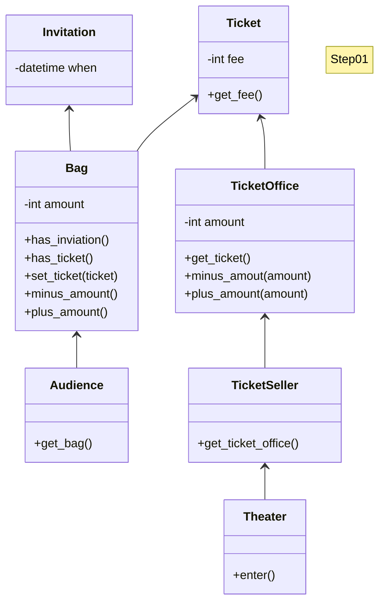

```mermaid
classDiagram
    note "Step01"
    
    Invitation <-- Bag
    Ticket <-- Bag
    Bag <-- Audience
    Ticket <-- TicketOffice
    TicketOffice <-- TicketSeller
    TicketSeller <-- Theater


    d
    class Audience{
        +get_bag()
    }

    class Bag{
        -int amount
        +has_inviation()
        +has_ticket()
        +set_ticket(ticket)
        +minus_amount()
        +plus_amount()
    }

    class Invitation{
        -datetime when
    }

    class Ticket{
        -int fee
        +get_fee()
    }

    class TicketSeller{
        +get_ticket_office()
    }

    class TicketOffice{
        -int amount
        +get_ticket()
        +minus_amout(amount)
        +plus_amount(amount)
    }

    class Theater{
        +enter()
    }


```