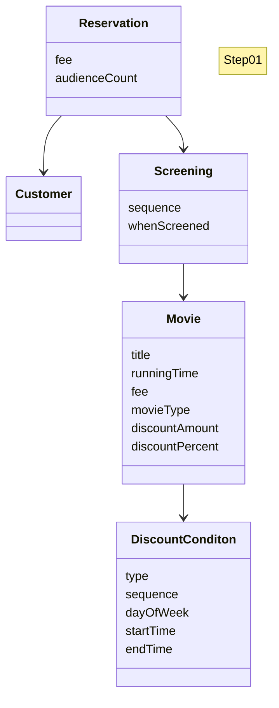

```mermaid
classDiagram
    note "Step01"
    
    Reservation --> Customer
    Reservation --> Screening
    Screening --> Movie
    Movie --> DiscountConditon

    class Customer{
    }

    class Reservation{
        fee
        audienceCount

    }

    class Screening{
        sequence
        whenScreened
    }

    class Movie{
        title
        runningTime
        fee
        movieType
        discountAmount
        discountPercent
    }

    class DiscountConditon{
        type
        sequence
        dayOfWeek
        startTime
        endTime
    }

   
```